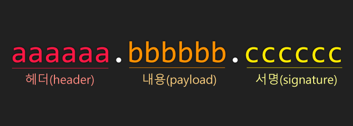

## JWT
---
토큰 기반 인증시스템에서 사용하는 JWT에 대해 알아보자.

---
<!--more -->

>JWT에 대해 알아보기전 토큰 기반 인증시스템의 기본적인 개념에 대해 알아보는 포스트를 먼저 보는것을 추천드린다.
[토큰(Token)기반 인증에 대한 소개](https://velopert.com/2350)


### JWT(JSON Web Token)이란?

JSON Web Token(JWT)은 웹표준(RFC 7519)구현체로서 JSON 객체를 사용하는 클레임 기반 토큰의 대표적인 예이다. JWT의 특징은 다음과 같다.

**많은 프로그래밍 언어에서 지원된다.**
JWT는 C, Java, Python, C++, R, C#, PHP, JavaScript, Ruby, Go, Swift 등 대부분의 주류 프로그래밍 언어에서 지원된다.

**자가수용적(self-contained)이다.**

JWT는 필요한 모든 정보를 자체적으로 지니고있다. 필요한 모든 정보에는 토큰에 대한 기본정보, 전달 할 정보, 토큰이 검증됐다는 것을 증명해주는 signature가 포함된다.

**쉽게 전달 될 수 있다**
JWT는 자가수용적이므로, 두 개체 사이에어 손쉽게 전달 될 수 있다. 웹서버의 경우 HTTP의 헤더에 넣어서 전달 할 수 있고, URL의 파라미터로 전달 할 수도 있다.

### JWT의 구조

JWT는 헤더(header), 페이로드(payload), 서명(signature) 세 가지로 나눠져 있으며, 아래와 같은 형태로 구성되어 있다.



`aaaaaa.bbbbbb.cccccc`

구분자 `.` 으로 구분된 세 부분으로 구성되어있다.
각 부분은 **base64** 로 인코딩 되어있다.


#### Header
헤더에는 typ와 alg 두 가지 정보로 구성되어있다.

- typ
   - 토큰의 타입을 지정.
- alg
   - 해싱 알고리즘을 지정.
   - 주로 HMAC SHA256 또는 RSA를 사용하며 이 알고리즘은 서명(signature)에서 사용한다.

아래와 같은 형태를 갖는다.

```
{
  "typ" : "JWT"
  "alg" : "HS256"
}
```

#### Payload
페이로드 부분에는 토큰에 담을 정보가 들어있다. 담을 정보의 한 부분을 클레임(claim)이라하고, 이 클레임은 Key/Value의 쌍으로 구성되어있다.

토큰에는 여러개의 클레임을 넣을 수 있다.

클레임은 다음과 같이 3가지로 나뉜다.

- 등록된 클레임(Registered Claim)
- 공개 클레임(Public Claim)
- 비공개 클레임(Private Claim)


**등록된 클레임 (Registered Claim)**

등록된 클레임은 토큰 정보를 표현하기 위해 이름이 이미 정해진 클레임들이다. 등록된 클레임은 선택적으로 사용이 가능하며 종류는 다음과 같다.

- `iss` : 토큰 발급자 (issuer)
- `sub` : 토큰 제목 (subject)
- `aud` : 토큰 대상자 (audience)
- `exp` : 토큰 만료시간(Expiration Time)
  - 시간은 NumericDate 형식이어야하며 언제나 현재 시간보다 이후로 설정되어있어야함.
- `nbf` : 토큰 활성 날짜(Not Before)
  - 이 날짜가 지나기 전 토큰은 활성화 되지 않는다.
- `iat` : 토큰이 발급된 시간(Issued At)
  - 이 값으로 토큰이 발급된지 얼마나 되었는지 확인이 가능하다.
- `jti` : JWT의 고유 식별자(JWT ID)
  - 중복 방지를 위해 사용하며, 일회용 토큰(Access Token 등)에 사용한다.

**공개 클레임 (Public Claim)**

공개 클레임들은 충돌이 방지된 (collision-resistant) 이름을 가지고 있어야 한다. 충돌을 방지하기 위해서, URI 형식으로 이름을 짓도록 한다.

```
{
  "https://inhog.github.io/all-categories/" : true
}
```

**비공개 클레임 (Private Claim)**

비공개 클레임은 위의 2경우에 해당하지않고, 서버와 클라이언트가 형태를 정해놓고 사용하는 클레임의 경우에 해당한다.

```
{
 "customClaim" : Request
}
```

**Payload의 예**
```
{
  "iss" : "Inhog",
  "sub" : "testToken",
  "https://inhog.github.io/all-categories/" : true,
  "customClaim" : Request
}
```

#### Signature
서명은 위에서 만든 **Header** 와 **Payload** 의 각 값을 **Base64** 로 인코딩 하고, 각 값을 합쳐서 비밀키를 이용해 헤더에서 정의한 알고리즘으로 해싱을하고, 이 값을 다시 **Base64** 로 인코딩하여 생성한다.


Header, Payload, Signature 값을 `.` 구분자를 가지고 합치면 하나의 토큰이 완성된다.

#### 참고

[JSON Web Token 소개 및 구조](https://velopert.com/2389)

[JWT공식페이지](https://jwt.io/introduction/)

[JWT(JSON Web Token) 이란?](https://elfinlas.github.io/2018/08/12/whatisjwt-01/)
